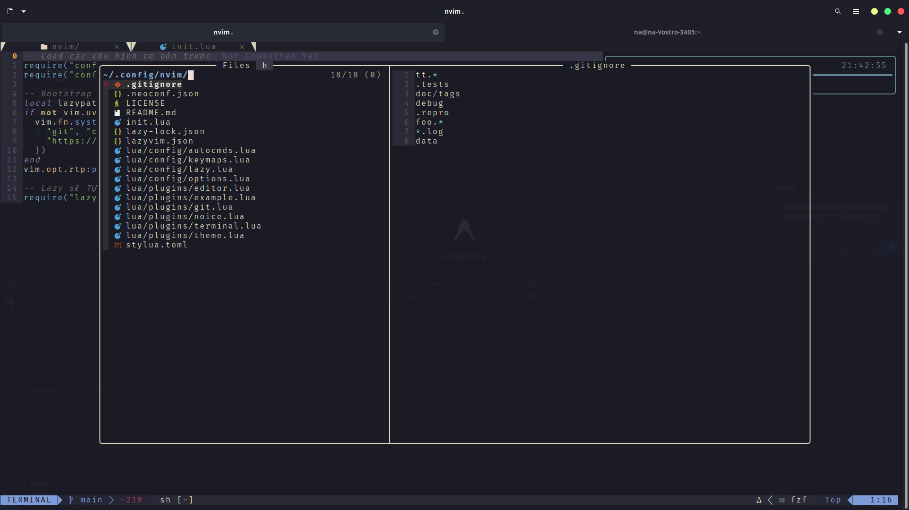
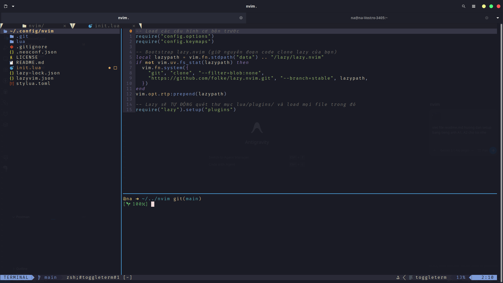
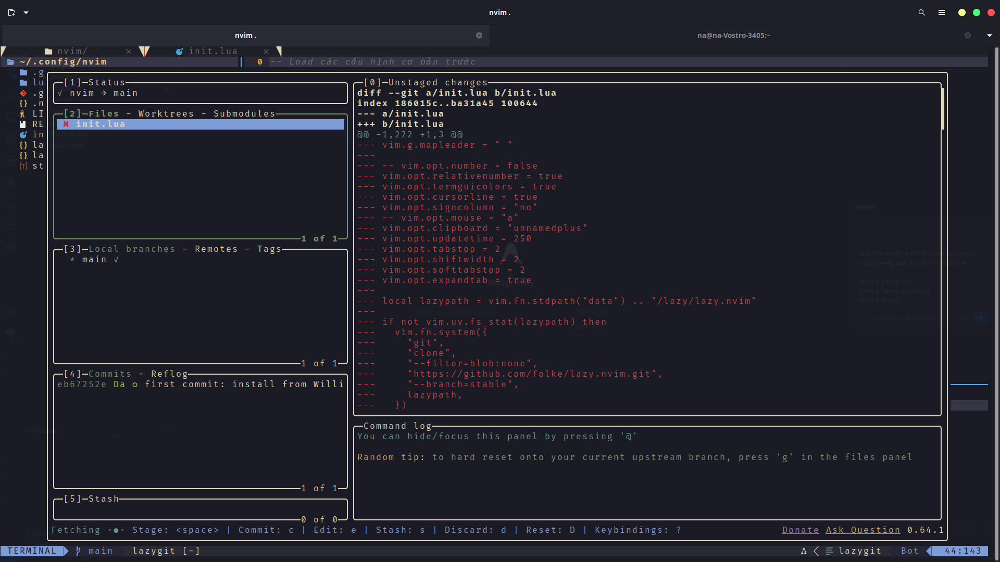

# My Neovim Setup

This is my Neovim setup. You need to install some tools to use it on Ubuntu.


## Demo Pictures

### Picture 1: fzf
**How to open:** In Neovim, press `Space` + `f` + `f`.


### Picture 2: Terminal
**How to open:** In Neovim, press `Control` + `/` (or `Space` + `f` + `t`).


### Picture 3: Lazygit
**How to open:** In Neovim, press `Space` + `g` + `g`.



## How to Install on Ubuntu

Please open your terminal and type these commands.


### 1. Install Git
Git is a tool to save your code work.
```bash
sudo apt update
sudo apt install git -y
```

### 2. Install Ripgrep
Ripgrep helps you search text inside files quickly.
```bash
sudo apt install ripgrep -y
```

### 3. Install fzf
fzf helps you find files fast.
```bash
sudo apt install fzf -y
```

### 4. Install Lazygit
Lazygit makes Git easy to see and use.
```bash
LAZYGIT_VERSION=$(curl -s "https://api.github.com/repos/jesseduffield/lazygit/releases/latest" | grep -Po '"tag_name": "v\K[^"]*')
curl -Lo lazygit.tar.gz "https://github.com/jesseduffield/lazygit/releases/latest/download/lazygit_${LAZYGIT_VERSION}_Linux_x86_64.tar.gz"
tar xf lazygit.tar.gz lazygit
sudo install lazygit /usr/local/bin
rm lazygit.tar.gz lazygit
```

